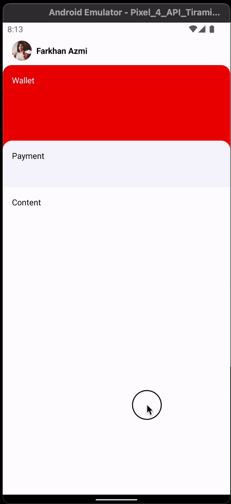
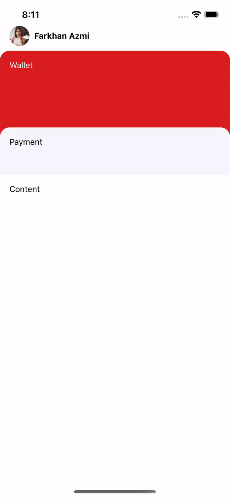

# LinkAja Dashboard Clone

A React Native implementation of the LinkAja mobile wallet dashboard with smooth animated scrolling and collapsible header sections.

## 📱 Screenshots

| Android | iOS | Original LinkAja |
|---------|-----|------------------|
|  |  |  |

## ✨ Features

- **Animated Header** - Profile section with smooth scroll animations
- **Collapsible Wallet Section** - Red wallet card that animates with scroll
- **Payment Section** - Quick access payment options
- **Smooth Scrolling** - Native driver animations for 60fps performance
- **Cross-Platform** - Works on Android, iOS, and Web
- **TypeScript** - Full type safety throughout the codebase
- **Safe Area Support** - Proper handling of notches and safe areas

## 🛠️ Tech Stack

- **React Native** 0.85.3
- **Expo** ~56.0.3
- **React** 19.2.3
- **TypeScript** ~6.0.3
- **React Native Safe Area Context** ~5.7.0

## 📋 Prerequisites

- Node.js (v18 or higher)
- Bun (package manager)
- Expo CLI (installed globally or via npx)

## 🚀 Installation

1. Clone the repository:
```bash
git clone <repository-url>
cd linkaja-clone
```

2. Install dependencies:
```bash
bun install
```

## 🎯 Running the App

### Start Development Server
```bash
bun start
```

### Run on Android
```bash
bun android
```

### Run on iOS
```bash
bun ios
```

### Run on Web
```bash
bun web
```

## 📁 Project Structure

```
linkaja-clone/
├── src/
│   ├── App.tsx           # Main app component with animation logic
│   └── styles.tsx        # StyleSheet definitions and constants
├── assets/               # App icons and images
├── gif/                  # Demo GIFs (android, ios, linkaja)
├── app.json              # Expo configuration
├── package.json          # Dependencies and scripts
├── tsconfig.json         # TypeScript configuration
├── index.ts              # Entry point
└── README.md             # This file
```

## 🎨 Key Components

### Header
- Displays user profile photo and name
- Fixed at the top of the screen
- Remains visible during scroll

### Wallet Section
- Red background (#D81E1F)
- Animates upward as user scrolls
- Height: 180px
- Rounded top corners

### Payment Section
- Light purple background (#F7F6FC)
- Quick access to payment options
- Height: 80px
- Positioned between wallet and content

### Content Section
- Scrollable area for main content
- White background
- Responsive height based on platform

## 🔧 Animation Details

The app uses React Native's `Animated` API with native driver for smooth 60fps animations:

- **Scroll Interpolation** - Maps scroll position to translation values
- **Native Driver** - Offloads animations to native thread
- **Clamp Extrapolation** - Prevents animations beyond defined ranges

## 📝 Available Scripts

- `bun start` - Start Expo development server
- `bun android` - Run on Android emulator/device
- `bun ios` - Run on iOS simulator/device
- `bun web` - Run on web browser

## 🎓 Learning Resources

- [React Native Documentation](https://reactnative.dev/)
- [Expo Documentation](https://docs.expo.dev/)
- [React Native Animated API](https://reactnative.dev/docs/animated)
- [TypeScript Handbook](https://www.typescriptlang.org/docs/)

## 📄 License

This project is licensed under the MIT License - see the LICENSE file for details.

## 👤 Author

Created as a React Native learning project and UI clone of LinkAja dashboard.

---

**Note:** This is a UI clone for educational purposes. It demonstrates React Native animation techniques and component composition patterns.
